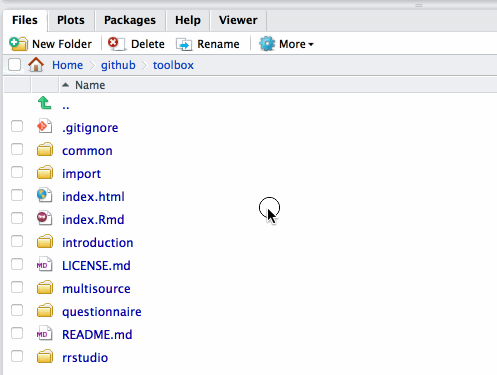
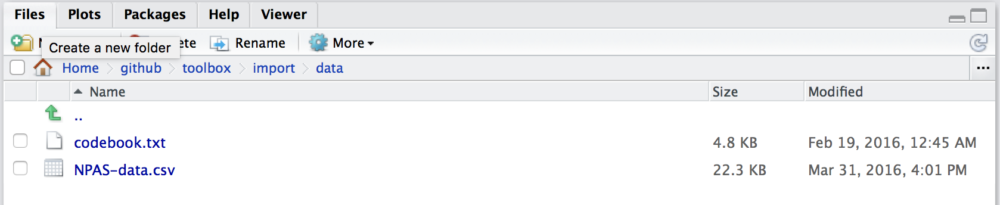
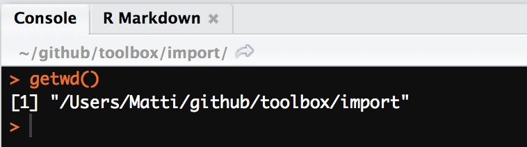
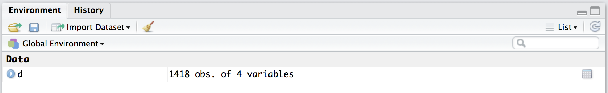
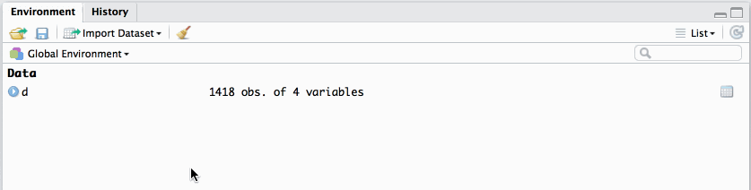
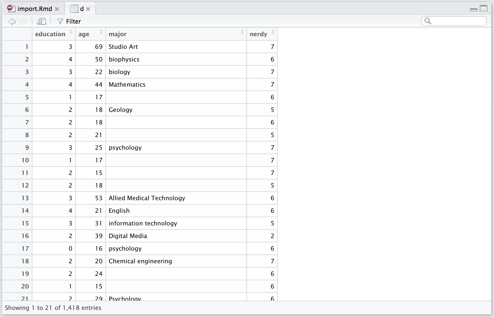

```{r chunk_opts, echo=F, warning=FALSE, message=FALSE, results = 'hide'}
library(knitrBootstrap)
source("../common/chunk_opts.R")
```

# Introduction

In SPSS or Excel, importing data is fairly self-explanatory: The user clicks through various menu items to locate the relevant data file in the computer's hard drive, and opens the file. In R, the analoguous operation is to _import data to the workspace_. Here, we'll locate data on the hard drive using RStudio's file dialogue, import the file to the workspace, and print its content's in the console.

This example data is a data file downloaded from <http://personality-testing.info/_rawdata/>, and contains answers to the [Nerdy Personality Attributes Scale](http://personality-testing.info/tests/NPAS/), along with some demographic variables. I have removed some variables from the file that are not relevant for the present purposes.

# Locating the data file

If you have downloaded the toolbox materials, the relevant folder for this tutorial is `/toolbox/import/`. So, we can fire up RStudio and navigate to the folder using RStudio's file navigator, and set it as the working directory:



The data file is in `/toolbox/import/data/` and is called `NPAS-data.csv`. The `.csv` extension means that the data are in a Comma Separated Values format, which is a common format for data; any Excel spreadsheet, for example, can be exported as a `.csv`, and both Excel and SPSS can open `.csv` files. There is also a `codebook.txt` file, detailing what the various variables in the `.csv` file mean.



It's important to recognize that R only looks for external files in the current working directory. You can see the current working directory on top of the R console, or print it in the console by typing `getwd()` and pressing `return`:



```{r print_cwd}
getwd()
```

Your working directory will be slightly different, because the default printout includes the username and other preceding folders (in my case, `/Users/Matti/github/`), but we need not be concerned of this here.

# Importing the data file

Now that we know the location and name of the data file, and the current working directory, we can ask R to read the `.csv` file from the `data/` folder by using the relative path to the file. Note that if the file was in the current working directory, we could simply call the file without the path, but we know the path to the file, and that the file is not in the current working directory, so we pass all this information to a function that reads `.csv` files:

```{r read_csv}
d <- read.csv("data/NPAS-data.csv")
```

The above function, `read.csv()` takes multiple arguments, but for the present purposes we only passed the location and name of the file to it, and save the function call to `d`. `d` now contains the contents of the `.csv` in a format that R understands, namely, it is a `data.frame`.

As a result of executing the above command, there is now an _object_ in the R environment, called `d`:



# Show me the data

Now that `d` is "in the R environment", we can look at it in various ways. If you click on the little blue arrow next to `d` in the Environment pane, you'll get a quick overview of what `d` contains:



First, you'll see that there are 1418 observations (rows) and 4 variables (columns). Clicking the arrow reveals the names, types, and first 10 values of each of these columns. Clicking on `d` itself (in the Environment pane) opens up the data viewer, which is very useful for looking at the data in a format familiar from SPSS and Excel:



This view reveals more of the actual values of the variables, and you can scroll up and down to inspect the entire `data.frame`.

Finally, we'll view the data within the R console, by typing a few simple commands. There are two very useful functions to quickly look at the data: `str()` and `head()`. `str()` prints out the structure of the `data.frame`:

```{r str}
str(d)
```

And `head()` shows the first six rows of the `data.frame`:

```{r head}
head(d)
```

You could also print out the entire contents of the `data.frame`, but 1418 rows would result in an information overflow, so I won't show the results of doing that. You can try it by typing `d` in the console, and hitting `return`.

```{r d, eval=F}
d
```

<small>`results not shown`</small>

# Figure 

To end this tutorial, I'll show a simple plot of the data, but won't reveal the code quite yet, as plotting is covered in later tutorials. By following through the toolbox tutorials, you'll be able to draw similar plots in no time!

```{r, echo = F, fig.cap = "Mean nerdiness (±1 SEM) for most common majors."}
library(dplyr)
library(ggplot2)
d$major <- tolower(d$major)
group_by(d, major) %>%
    mutate(n = n()) %>%
    filter(n > 7 & n < 500, major != "#name?") %>%
    summarise(Nerdy = mean(nerdy),
              n = n(),
              nerdy_se = sd(nerdy, na.rm=T) / sqrt(n)) %>%
    mutate(major = reorder(major, Nerdy)) %>%
    ggplot(aes(x = Nerdy, y = major)) +
    geom_segment(aes(x=3.5, xend=Nerdy, y=major, yend=major), 
                 lty = 2, col = "grey50") +
    geom_point() +
    geom_errorbarh(aes(xmin = Nerdy - nerdy_se, xmax = Nerdy + nerdy_se)) +
    geom_point(data = filter(group_by(d, major) %>%
                        summarise(Nerdy = mean(nerdy),
                        n = n(),
                        nerdy_se = sd(nerdy, na.rm=T) / sqrt(n)), 
                        major == "psychology"), 
               col = "red", size = 4) +
    scale_y_discrete("Major", expand = c(0.01, 0.01)) +
    scale_x_continuous(expand = c(0, 0.01)) +
    theme(axis.title.y = element_blank())
```

Hey, maybe we aren't such nerds after all!

# References


